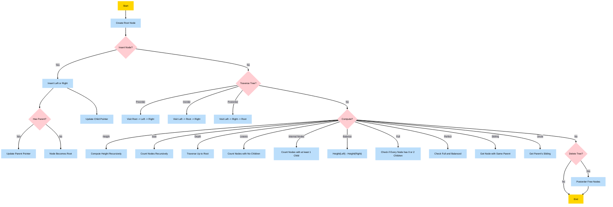

# C - Binary trees

## Description

This project is focused on the implementation and manipulation of binary trees in C. You will build various types of binary trees and implement core functionalities such as insertion, deletion, traversal, height, depth, balance, and more.

It aims to deepen your understanding of dynamic data structures, recursion, and efficient memory management.

---

## Requirements

- **Allowed editors:** `vi`, `vim`, `emacs`
- All your files will be compiled on **Ubuntu 20.04 LTS** using:
  ```bash
  gcc -Wall -Werror -Wextra -pedantic -std=gnu89
  ```
- All your source files must end with a new line
- A `README.md` file is mandatory at the root of the project
- Your code must follow the **Betty style**:
  - It will be checked using `betty-style.pl` and `betty-doc.pl`
- **No global variables** are allowed
- You must not have more than **5 functions per file**
- **Standard library** usage is allowed
- All function prototypes must be included in your `binary_trees.h` header file
- All header files must be **include guarded**

---

## Files and Functions

| File                  | Description                              |
|:-----------------------|------------------------------------------|
| `binary_trees.h`                | Header file containing all prototypes and structures |
| `0-binary_tree_node.c`          | Creates a binary tree node                          |
| `1-binary_tree_insert_left.c`   | Inserts a node as the left-child                    |
| `2-binary_tree_insert_right.c`  | Inserts a node as the right-child                   |
| `3-binary_tree_delete.c`        | Deletes an entire binary tree                       |
| `4-binary_tree_is_leaf.c`       | Checks if a node is a leaf                          |
| `5-binary_tree_is_root.c`       | Checks if a node is the root                        |
| `6-binary_tree_preorder.c`      | Goes through a binary tree using pre-order traversal|
| `7-binary_tree_inorder.c`       | Goes through a binary tree using in-order traversal |
| `8-binary_tree_postorder.c`     | Goes through a binary tree using post-order traversal|
| `9-binary_tree_height.c`        | Measures the height of a binary tree                |
| `10-binary_tree_depth.c`        | Measures the depth of a node in a binary tree       |
| `11-binary_tree_size.c`         | Measures the size of a binary tree                  |
| `12-binary_tree_leaves.c`       | Counts the leaves in a binary tree                  |
| `13-binary_tree_nodes.c`        | Counts the nodes with at least 1 child in a binary tree |
| `14-binary_tree_balance.c`      | Measures the balance factor of a binary tree        |
| `15-binary_tree_is_full.c`      | Checks if a binary tree is full                     |
| `16-binary_tree_is_perfect.c`   | Checks if a binary tree is perfect                  |
| `17-binary_tree_sibling.c`      | Finds the sibling of a node                         |
| `18-binary_tree_uncle.c`        | Finds the uncle of a node      
> 💡 You can create `main.c` files for testing your functions.

---

## Data Structures

```c
/**
 * struct binary_tree_s - Binary tree node
 *
 * @n: Integer stored in the node
 * @parent: Pointer to the parent node
 * @left: Pointer to the left child node
 * @right: Pointer to the right child node
 */
struct binary_tree_s
{
    int n;
    struct binary_tree_s *parent;
    struct binary_tree_s *left;
    struct binary_tree_s *right;
};

typedef struct binary_tree_s binary_tree_t;
typedef struct binary_tree_s bst_t;
typedef struct binary_tree_s avl_t;
typedef struct binary_tree_s heap_t;
```

---

## Compilation

To compile your code, use the following format:

```bash
gcc -Wall -Werror -Wextra -pedantic -std=gnu89 *.c -o binary_tree_test
```

## Flowchart
---


## Usage

Here’s an example of how you can checks if a given node is a root:

```c
#include <stdlib.h>
#include "binary_trees.h"

int binary_tree_is_root(const binary_tree_t *node)
{
	if (node != NULL && node->parent == NULL)
	{
		return (1);
	}
	return (0);
}
```

---

## 👷🏼‍♂️👷🏼‍♂️ <span id="authors">Authors</span>

**👷🏼‍♂️ Haitu Nguyen**
- GitHub: [@N-Haitu31](https://github.com/N-Haitu31)

**👷🏼‍♂️ Jérémy LAURENS**
- GitHub: [@JeremyLrs](https://github.com/JeremyLrs)
- LinkedIn: [@jeremylrs](www.linkedin.com/in/jeremylrs)

